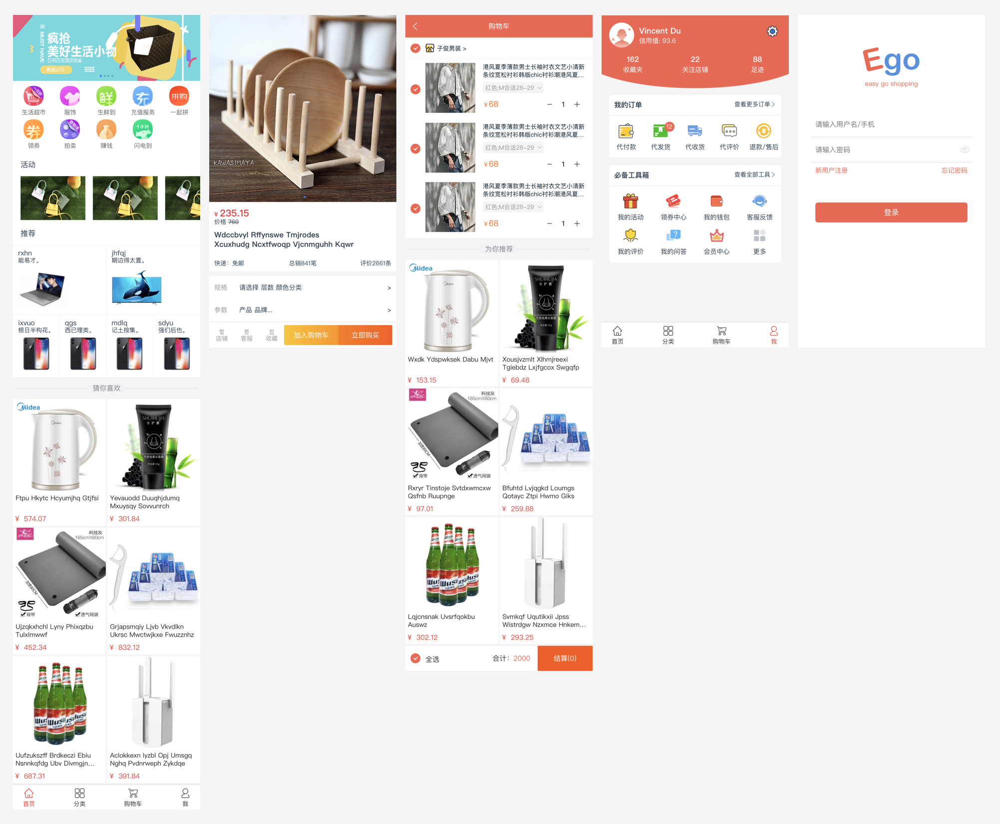

<p align="center">
  <a>
    
  </a>
</p>

# Ego 移动端购物商城
> 基于vue2.0 + typescript技术开发的移动端项目, 使用官方推荐最新的脚手架搭[vue-cli 3.x](https://cli.vuejs.org/)搭建

> 开发者：稻草叔叔

> 项目地址：https://github.com/vincentSea/vue-webapp

## 界面
**项目所有的界面都是自己设计的， 当然肯定有参考因素存在。**

<p align="center">
  <a>
    
  </a>
</p>

## 技术栈
**核心: vue + typescript + vuex + vue-router**

**其他:**

- [vue-class-component](https://github.com/vuejs/vue-class-component) : ES / TypeScript decorator for class-style Vue components.

- [vue-property-decorator](https://github.com/kaorun343/vue-property-decorator) : This library fully depends on vue-class-component, so please read its README before using this library.

- [vuex-class](https://github.com/ktsn/vuex-class) : Binding helpers for Vuex and vue-class-component

## 安装&构建

```
# 安装依赖
npm install

# 开发环境
npm run serve

# 打包项目
npm run build
```

## 项目目录
```
├── README.md                            # 项目说明
├── babel.config.js                      # babel配置文件
├── package-lock.json                    
├── package.json  
├── public                               # 公用目录 （存在首页入口文件、静态资源）
├── src                                  # 核心代码目录
│   ├── App.vue                          # 组件入口文件
│   ├── api                              # 接口服务
│   ├── assets                           # 静态目录（存放图片，插件等）
│   ├── components                       # 公用组件库
│   ├── config.ts                        # 全局配置项
│   ├── main.ts                          # 项目js入口文件，包括路由配置等
│   ├── registerServiceWorker.ts         # ServiceWorker
│   ├── router                           # 路由配置
│   ├── store                            # vuex状态管理
│   ├── style                            # 公用样式
│   ├── typings                          # 定义插件
│   ├── utils                            # 工具库
│   └── views                            # 视图目录
└── tsconfig.json
```

## 感想
> 因为之前没有接触过tpyescript的项目。所以筹备做一个vue+ts的项目。也翻阅了不少开源项目和资料。此项目也是属于我在空闲时间上开发的。所有的界面设计和功能设计，都是有个人完成。存在很多不完善，也仅供参考学习。

> 当然希望给个[Star](https://github.com/vincentSea/vue-webapp)。嘻嘻！

## License

[MIT](https://github.com/vincentSea/vue-webapp/blob/develop/LICENSE)

Copyright (c) 2018 稻草叔叔
